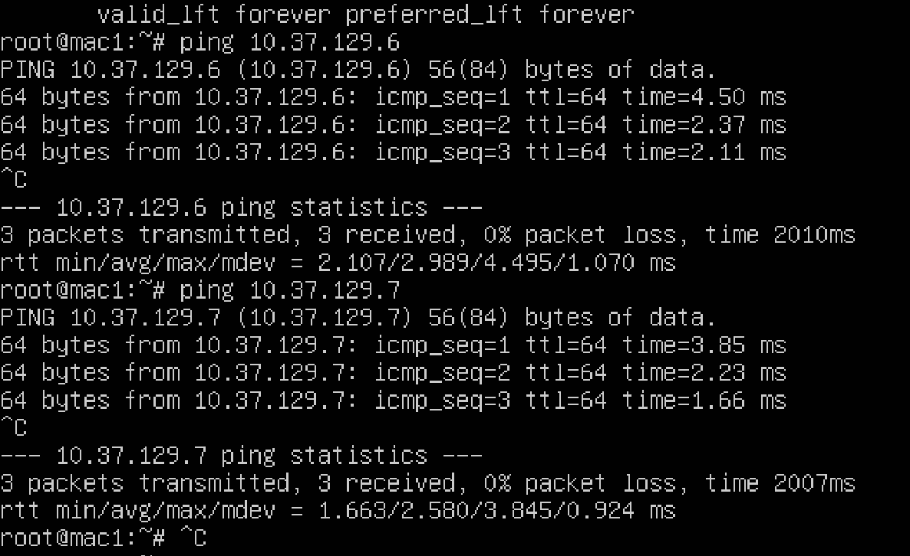
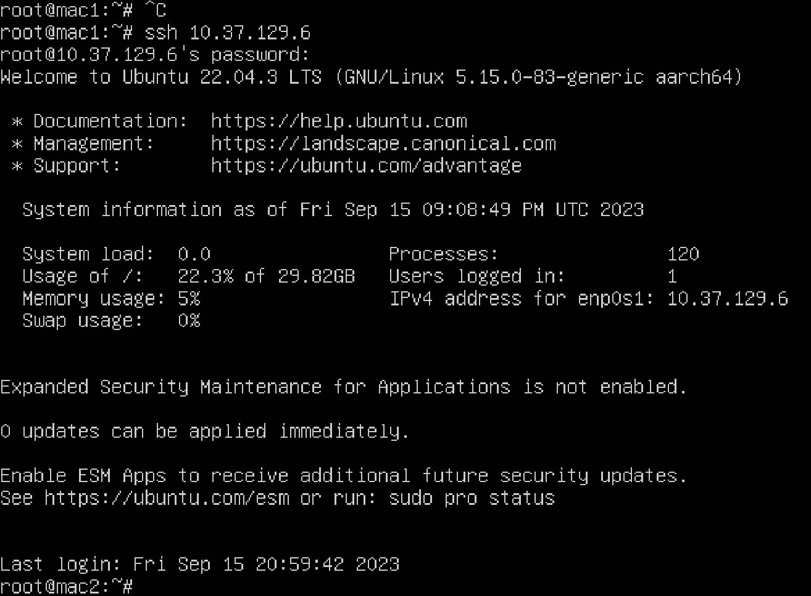

# Лабораторная работа 1

### Цель работы
Передать файл с пк Б на пк С, использую терминал пк А.

### Предварительные шаги

Так как трех пк не было в наличии, то были созданы
три виртуальных машины на основе Ubuntu-server. Виртуальные
машины были запущеные с помощью ПО UTM, основанному на QEMU. 

### Локальная сеть

| ПК | Имя ПК | IP адресс   |
|----|--------|-------------|
| А  | mac1   | 10.37.129.5 |
| Б  | mac2   | 10.37.129.6 |
| С  | mac4   | 10.37.129.7 |

Все ПК находятся в одной локальной сети. Это было проверено с
помощью программы ping. Результаты её выполнения можно
увидеть ниже. 

### Установка SSH соединения

Для подключения по протоколу SSH на виртальные машины был
установлен openssh-server. 
Управление ПК Б было полученно с помощью команды `ssh <ip-adress>`.
После ее ввода потребуется ввести пароль.

### Передача файла

На системе Б был заранее создан файл `Salam.txt`.

Его передача в папку media на пк С осуществлялась командой 
`scp [OPTIONS] [[user@]src_host:]file1 [[user@]dest_host:]file2`

Для проверки выполнения передачи 
введем `ls  /media` на ПК С. В списке файлов можем увидеть
`Salam.txt`. Значит файл был успешно передан. 

### Вывод

В данной лабороаторной работе с помощью протокола SSH и 
утилиты scp мы смогли успешно передать файл `Salam.txt` с ПК Б
на ПК С, используя командную строку ПК А. 

