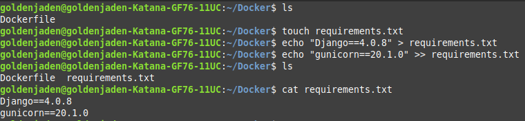

<h1 align="center">Лабораторная работа 2</h1>

### Цель работы
Написать два Dockerfile – плохой и хороший. Плохой должен запускаться и работать корректно, но в нём должно быть не менее 3 “bad practices”.
В хорошем Dockerfile они должны быть исправлены. Также привести 2 плохие практики по использованию хорошего контейнера.

### Предисловие
Было решено контейнеризировать веб-приложение, созданное с помощью Django Framework.
В качестве HTTP-сервера для нашего приложения был выбран Gunicorn.

### Плохие практики (добавить ссылки якори)
* #### Избыточность 

  Использование образа ubuntu, вместо более подходящего для нашей цели образа python.
* #### Использование `:latest` версий

  Нарушает неизменность контейнера, так как обновление образа может привести к ошибке.
* #### Копирование всех файлов одной командой

  Может плохо сказаться на производительности контейнера. 

### Часть 1. Подготовка Django-проекта
Для начала создадим папку с пустым Dockerfile-ом и файлом         `requirements.txt`, в который запишем требуемые для установки библиотеки Python.

Далее создаём виртуальное окружение Python и активируем его. С помощью команды `django-admin startproject -v 3 Docker .` создаём приложение Django с именем Docker.

.png)

Создаём файл .dockerignore, в который добавляем:
* db.sqlite — база данных проекта. 
* venv — папка с виртуальным окружением
* \_\_pycache\_\_ — папка с байткодом python модулей/приложений

.png)

### Часть 2. Заполнение Dockerfile
Пишем инструкции в Dockerfile.
Подключаем образ `ubuntu:latest`

Устанавливаем `python3` и `pip`.

.png)

