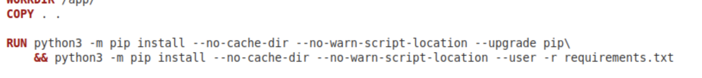
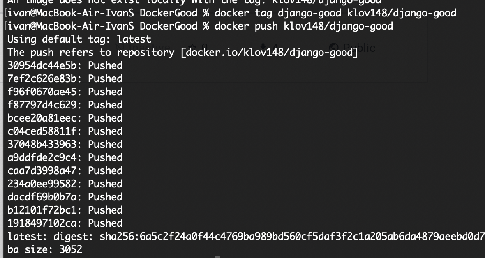

<h1 align="center">Лабораторная работа 2</h1>

### Цель работы
Написать два Dockerfile – плохой и хороший. Плохой должен запускаться и работать корректно, но в нём должно быть не менее 3 “bad practices”.
В хорошем Dockerfile они должны быть исправлены. Также привести 2 плохие практики по использованию хорошего контейнера.

### Предисловие
Было решено контейнеризировать веб-приложение, созданное с помощью Django Framework.
В качестве HTTP-сервера для нашего приложения был выбран Gunicorn.

### Плохие практики
* #### [Избыточность](#12)

  Использование образа ubuntu, вместо более подходящего для нашей цели образа python.
* #### [Использование `:latest` версий](#12)

  Нарушает неизменность контейнера, так как обновление образа может привести к ошибке.
* #### [Копирование всех файлов одной командой](#3)

  Может плохо сказаться на производительности контейнера. 
* #### [Миграции во время билда](#12)
  Может привести к ошибкам, если база данных
  будет не доступна во время сборки или если
  надо использовать тот же образ с другой бд.

## Глава 1. Плохой Докер.

### Часть 1. Подготовка Django-проекта
Для начала создадим папку с пустым Dockerfile-ом и файлом         `requirements.txt`, в который запишем требуемые для установки библиотеки Python.


Далее создаём виртуальное окружение Python и активируем его. С помощью команды `django-admin startproject -v 3 Docker .` создаём приложение Django с именем Docker.

.png)

Создаём файл .dockerignore, в который добавляем:
* db.sqlite — база данных проекта. 
* venv — папка с виртуальным окружением
* \_\_pycache\_\_ — папка с байткодом python модулей/приложений


.png)

### Часть 2. Работа с Docker
Пишем инструкции в Dockerfile.
<a name="12">Подключаем образ `ubuntu:latest`</a> *(bad practice #1, #2)*

Устанавливаем `python3` и `pip`.

<a name="3">Копируем файлы из нашей директории в контейнер.</a> *(bad practice #3)*

С помощью `pip` устанавливаем библиотеки из файла 'requirements.txt'

Производим миграции в БД. *(bad practice #4)*

С помощью команды `CMD`, которая вызывается в начале работы контейнера, поднимаем сервер gunicorn.
Открываем порт 8000 командой `EXPOSE 8000`.

[Заполнение Dockerfile](./images/Dockerfile(4).png)

Билдим наш Dockerfile в образ "django".

.png)

Поднимаем контейнер командой `docker run`, при этом с помощью параметра `p` открываем порт 8000.

.png)

На хосте переходим по 127.0.0.1:8000 и видим поднятый сервер.


.png)


## Глава 2. Хороший Докер.

### Правильный выбор образа

Первым делом выберем подходящий образ.
Логично, что для запуска Django приложения 
стоит выбрать образ Django. Однако, если 
зайдем на страницу официального образа Django
на Docker Hub то увидим, что образ отмечен как
Вместо него рекомендуется использовать Python. Его мы
и выберем.


Был выбран образ 3.11.5-bookworm, так как версия 3.11.5
использовалась при разработке проекта. Приставка bookworm
означает кодовое имя релиза Debian, на основе которого
был создан image. Версии slim и alpine рекомендуется
использовать в случае ограниченности места, поэтому
нам нет смысла их ставить. 
Для использования данного образа в Dockerfile
заменим строчку `FROM ubuntu:latest` на `FROM python:3.11.5-bookworm`
Таким образом мы подобрали image, который лучше подходит
под наши цели. Так же были указав точную версию
(а не тег latest) мы избавились от возможных проблем
из-за более новой версии образа.

### Ускоряем сборку контейнера

В докере используется система кэша, которая позволяет
ускорить сборку. Каждая инструкция внутри 
Dockerfile преобразуется в слой в конечном образе. 
Кэширование позволяет не пересобирать верхние слои, 
которые не были подвергнуты изменениям. Ниже приведена
иллюстрация принципа работы с официального сайта Docker.


В случае нашего Dockerfile преимущества описанной системы
можно использовать при копировании проекта
и установке зависимостей. Если мы сначала будем
копировать в контейнер файл зависимостей и устанавливать их, 
а только потом копировать весь проект, то при изменении файлов
проекта не надо будет заново ставить необходимые модули.

В итоге команды 

Были заменены на 


### Убираем миграции

Как уже говорилось выше, миграции во время сборки 
могут привести к ошибкам, если база данных в этот момент 
не доступна или мы хотим использовать другую БД (например
тестовую). Дабы избежать этой проблемы можно выполнить
миграции после запуска контейнера через команду
`docker exec -it <container_id> python manage.py migrate`

### Конечный результат

Исправленный Dockerfile можно увидеть ниже


Проверим, всё ли работает как раньше.\
Для начала соберем образ командой\
`sudo docker buildx build -t good_dockerfile .`

Теперь запустим контейнер командой\
`sudo docker run -p 8000:80 good_dockerfile`\

На хост-машине открываем 127.0.0.1:8000 и видим поднятый
сервер.


## Плохие практики по использованию этого контейнера

### Использование в качестве виртуальной машины

Важно понимать различие в работе и предназначении виртуальных
машин и контейнеров. Это неэффективно и небезопасно. 
Данные технологии создавались для достижения различных целей. 


### Хранение секретов внутри этого контейнера

Не стоит хранить секреты внутри контейнера. Для этого есть
более безопасные способы хранения.

## Итоги

В ходе работы мы смогли написать два Dockerfile, в
одном из которых мы показали плохие практики. При этом
оба Dockerfile успешно запускались и функционировали.

<h1 align="center">Задание со звёздочкой</h1>

### Установка и настройка minikube

Для выполнения работы будет использоваться minikube - инструмент, 
позволяющий запустить кластер k8s на локальной машине. \
Перед установкой minikube надо поставить 
kubectl (инструмент для управления кластерами k8s). \
`brew install kubectl` \
Проверяем успешность установки вводом `kubectl` в терминал. 
Установка прошла успешно 


Далее с помощью комманды `alias k=kubectl` вместо полного названия 
будет вводиться сокращение.\
Установим minikube командой `brew install minikube`

Запустим minikube командой `minikube start --driver=docker`. При 
первом запуске надо указать driver. Был выбран docker, так 
как только он поддерживается на используемой системе. 

### Выгрузка образов в docker hub

Для того, чтобы использовать созданные раннее образы 
внутри подов, их надо выгрузить в docker hub. \
Далее процесс будет описан только для образа, созданного на основе 
Dockerfile без плохих практик. Для другого образа действия аналогичные.\
Соберем образ командой `docker buildx build . -t django-good`.
Далее создадим этому образу тэг с указанием имя пользователя на 
Docker hub и репозитория командой 
`docker tag django-good <username>/django-good` \
Теперь надо выполнить команду `docker hub` и выполнить вход
в аккаунт. 


Теперь можем выгрузить образ командой `docker push <username>/django-good`


Готово! Теперь образы готовы к использованию

### Настройка Deployment и Service

Ниже будут описаны действия для образа django-good. Для образа 
django-bad действия аналогичные, кроме названий и самого образа. \
Для создания подов с нужным контейнером внутри создадим файл
deployment.yaml. Его содержание представлено ниже.
```
apiVersion: apps/v1
kind: Deployment
metadata:
  name: django-good-deployment
  labels:
    app: django-good
spec:
  replicas: 3
  selector:
    matchLabels:
      app: django-good
  template:
    metadata:
      labels:
        app: django-good
    spec:
      containers:
        - image: klov148/django-good
          name: django-good
          ports:
            - containerPort: 8000
              name: gunicorn
```
Разберем некоторые строчки. \
В строчке `kind: Deployment` мы указываем, что описываем именно
Deployment. В строке `replicas: 3` мы задаем, сколько идентичных подов
будет создано. Нужный docker образ указывается в строке 
`image: klov148/django-bad`.\
Применим deployment командой `k apply -f deployment.yaml`.
Вывведем список подов командой `k get pods -o wide` и убедимся, 
что все прошло успешно.


Сейчас поды между собой связаны, но получить доступ из браузера к ним
нельзя. Чтобы это исправить создадим service.yaml. Его код
преставлин ниже
```
apiVersion: v1
kind: Service
metadata:
  name: django-good
  labels:
    app: django-good
spec:
  type: NodePort
  selector:
    app: django-good
  ports:
    - port: 8000
      targetPort: 8000
```
В строчке `type: NodePort` мы указали тип service. Именно этот тип нужен
чтобы получить доступ к контейнерам из вне.\
Применим service командой `k apply -f deployment.yaml`. Вызовем список
service командой `k get svc` и убедимся, что всё прошло успешно 
(на скриншоте есть так же другой аналогичный services, так как
снимок экрана был сделан после выполнения всего задания). 


Проделаем аналогичный действия для второго образа.

### Конечный результат

Ниже представлен скриншот, на котором видно, что 
было успешно создано два deployment, два service и 
шесть подов (3 с одним образом и 3 с другим).


Подключимся поочередно к первому и второму service. 


Как видим, все работает!

## Итоги

В данной лабораторой работе мы успешно запустили внутри
minikube Dockerfile, написанные раннее. Так же нам удалось
Получить к ним доступ из браузера.
