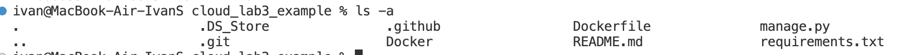
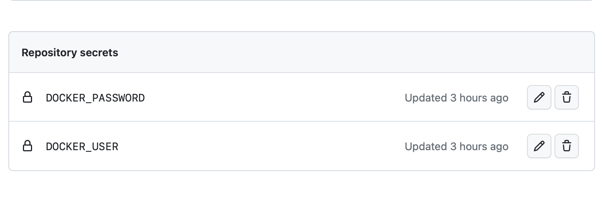
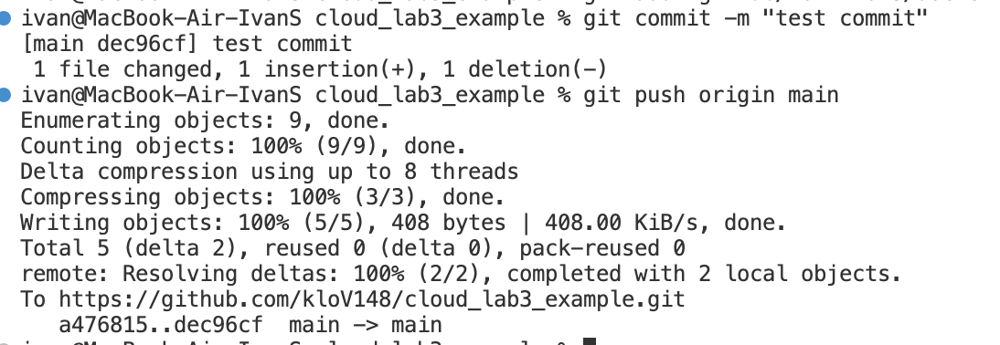
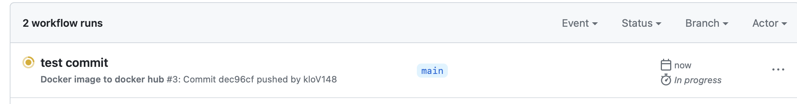
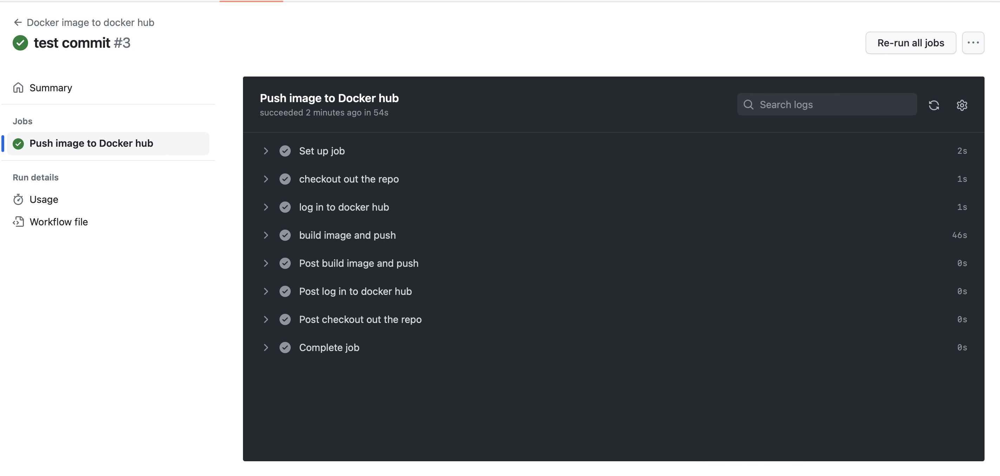
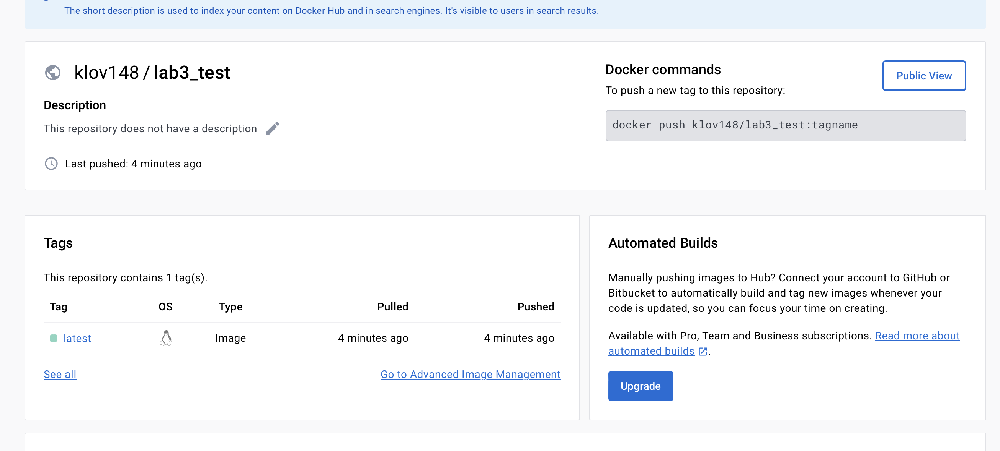

<h1 align="center">Лабораторная работа 3</h1>

## Цель

Надо сделать, чтобы при пуше в репозиторий собирался докерфайл
и результат его сборки сохранялся куда-нибудь. 
В нашем случае мы будем собирать образ из прошлой лабораторной 
и автоматически пушить его на docker hub.

## Подготовка

Создадим репозиторий на github ([ссылка на него](https://github.com/kloV148/cloud_lab3_example))
и загрузим на него необходимые файлы (Dockerfile
и файлы проекта). Для достижения описанной цели будем
использовать github actions. 
Создадим в папке директорию `.github/workflows`.


## Настройка автоматического билда и пуша в docker hub

Для начала добавим секреты в репозитории, которые 
будут хранить имя пользователя и пароль от аккаунта 
docker hub.



Теперь настроим workflow. Для этого создадим файл 
docker-push.yml внутри раннее созданной директории
.github/workflows. Конечный код внутри этого файла
представлен ниже.

```
name: Docker image to docker hub

on: 
  push:
    branches:
      - 'main'
jobs:
  push_to_docker_hub:
    name: Push image to Docker hub
    runs-on: ubuntu-latest
    steps:
      - name: checkout out the repo 
        uses: actions/checkout@v4
      
      - name: log in to docker hub 
        uses: docker/login-action@v3
        with:
          username: ${{ secrets.DOCKER_USER }}
          password: ${{ secrets.DOCKER_PASSWORD }}

      - name: build image and push
        uses: docker/build-push-action@v5
        with:
          context: .
          push: true
          tags: klov148/lab3_test:latest
```

Разберем его. 

В строке `name: Docker image to docker hub` мы указываем имя.
Далее мы описываем, в каких случаях будет запускаться
workflow. В данном случае при пуше в веку 'main'.

Теперь надо описать то, что будет выполняться. 
Строка `runs-on: ubuntu-latest` указывает, на основе какого
образа будет выполняться данная конфигурация. 
После этого в `steps` мы описываем шаги.
Каждый шаг начинается с указания его имени.  \
В `checkout out the repo` проверяется репозиторий, 
чтобы workflow мог получить доступ к нему. \
Шаг `log in to docker hub` отвечает за вход в docker hub.
В поле with мы подтягиваем имя пользователя и пароль, 
указанные раннее в секретах. \
В заключительном шаге `build image and push` 
мы (как неожиданно) собираем образ и пушим его в 
docker hub. В uses указываем, надо ли пушить, указываем
контекст сборки, а так же тег образа. \
Теперь все готово для работы 

## Проверка
Сделаем тестовый коммит. 

Теперь зайдем в наш репозиторий на GitHub и откроем 
раздел Actions. В нем можно увидеть, что появился
workflow.

Спустя несколько секунд можно увидеть, что процесс
успешно завершен. 

Проверим docker hub.

Как мы видим, образ успешно был загружен. 

## Выводы

С помощью github actions мы смогли настроить
автоматическую сборку и выгрузку docker образа
на docker hub.

# Задание со звёздочкой

В процессе....

